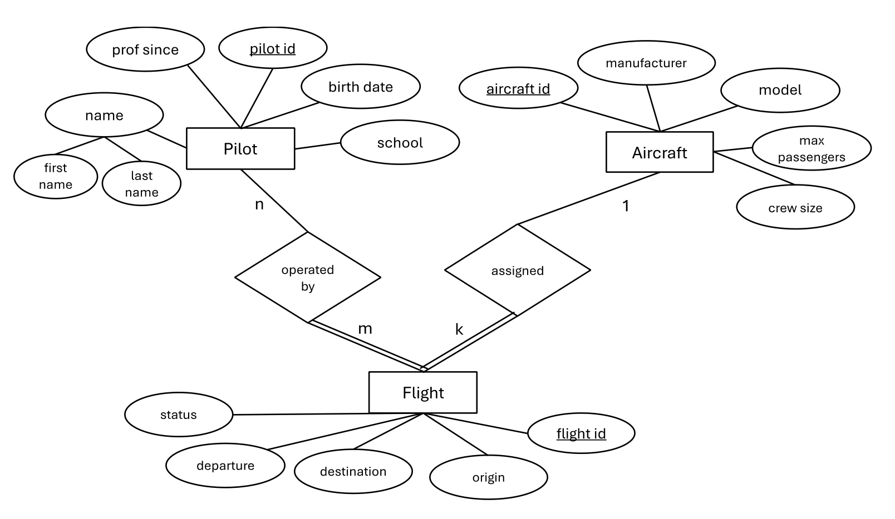
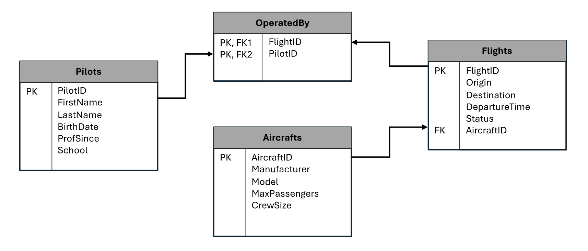

## Databases and Cloud - Python SQLite Assignment 

#### Task 1. Entity – Relationship Model design and conversion to the Relational Model

An Entity – Relationship (E-R) model represents real-world objects (e.g. “persons”, “places” and “events”) as entity sets, it maps their associations as relationships, and it highlights any attributes describing these entities. 

Given the task’s assumptions , the E-R model considers three entity sets: “Pilots”, “Aircrafts” and “Flights”. Each entity has an attribute acting as the unique identifier (also used as the primary key of the respective table under the relational model conversion), as well as a number of other single-valued attributes (Graph 1). Most of those attributes are simple, but one of them is composite (pilot’s name).

As each flight is assigned only a single aircraft, but aircrafts can be used to make several flight routes, there is a many-to-one relationship between the two entities (“Flights” and “Aircrafts”). This is labelled as “Assigned” on the E-R diagram, as a flight is assigned “1” aircraft, while an aircraft can be assigned to “k” flights. 

“Pilots” and “Flights” entities are connected with a many-to-many relationship. This is because a pilot can conduct “m” flights, while a flight can have “n” pilots. This relationship is called “Operated By” because a flight is “operated by” pilots.

Lastly, as a flight cannot be operated without pilots, nor it can take place  without an aircraft (i.e. there has to be some relationship between a flight and aircrafts/pilots), then “Flights” are said to be an entity set with “total participation”. On Graph 1, this is delineated with double lines.
     

##### Graph 1. Entity - Relationship model

Graph 2 shows the conversion of the E-R model’s entities and relationships into the relational model format. The relation model uses tables (i.e. relations) to represent the data and their relationships. 

##### Graph 2. Relational model

Each entity set (“Pilots”, “Aircrafts”, “Flights”) has each own table under the relational model as well as its own primary key, which is used to identify a single record from that table.

The "many-to-one” relationship (“Assigned”) of “Flights” and “Aircrafts” can be represented by including the “Aircrafts” table’s primary key (i.e. “AircraftID”) to the “Flights” table. This is possible because each flight is associated with only a single  aircraft, that is also uniquely identified by this id.

The “many-to-many” relationship (“Operated by”) that exists between “Pilots” and “Flights” is represented by a relationship table in the relational model (called “OperatedBy”) which contains a composite primary key comprised from the unique combinations of the flight and pilot tables’ primary keys (“FlightID” and “PilotID”). This table can be used to link a pilot with the flights they are associated with.

#### Task 2. Relational Model implementation

The relational model described above (Graph 2) is implemented in the Python script.

#### Task 3. Discussion of features used in the implementation

##### 3.1 Overview of menu options

The user interacts with the program through numerical and textual input. The main menu lists all available options and splits them by category. For most of the following options, users are first shown an intermediary menu that lists the database’s tables and asks them to select which table they would like to use.
Options 1 through 5 allow the program’s user to create or drop a table, to view the current schema, to view tables that were previously deleted and to optionally import bulk data to the four tables of the relational model. The last option was added as a helper and optional method, that is on top of the insertion functionality.
 
Option 6 allows the user to add/insert a new record to the table, while options 7 and 8 allow them to update/delete an existing record. The latter two options require the primary key (PK) as input from the user to identify the record.
Option 9 displays all records of a user-specified table, whereas option 10 searches a table and returns a single record based on the primary key. Option 11 searches a table for a non-primary key attribute and returns every record matching the user’s input value.

Lastly, four summary statistics are calculated using options 12 through 15 (e.g. number of flights by flight status, or the pilots’ years of professional experience). The user can exit the program by typing “0”.

##### 3.2 Database management and review

The program implements the schema of the relational model described in Graph 2. At the beginning of the program, an instance of the “DBOperations” class is called, creating the database and its four tables (if they do not already exist). However, to showcase the program’s schema management capabilities, SQL’s CREATE TABLE and DROP TABLE commands are utilized. Specifically, the program provides the user the capacity to drop any of the four tables, as well as to create them after they have been dropped.

The user is able to view which tables are available and which have been deleted through the menu’s options 3 and 4.

##### 3.3 Program classes and other information

Besides the “DBOperations” class, the program contains a distinct class for each of the four tables. These classes contain functions that (a) validate user input whenever this is required, (b) store attribute values, and (c) handle insertion, update, and deletion of records.

While the program is running, users have typically the option to move back to the main menu by typing “r” (which stands for return).
 
The “DBOperations” class includes a function that “prettifies” record presentation in a pseudo-table format.
 
##### 3.4 Insert – Update - Delete records

To insert, update or delete a table record, the user must first select a table:
 
In the case of insertion, once a table has been selected, the user will be prompted to type some table-specific information, such as selecting a primary key for the new record (this new id is confirmed/validated not to exist on the table):
 
Apart from the table’s PK, the user will be prompted to add input for every table attribute:
 
Each time the user adds their input for an attribute, the program validates whether the information entered can be accepted. Most of these rules are described below:
•	A flight's destination cannot be the same as the flight's origin
•	A flight's status must be either "Landed", "Delayed", "Scheduled", or  "Cancelled"
•	A flight's aircraft id must be contained in the Aircraft's table as primary key
•	A flight's departure date must respect the format "YYYY-MM-DD"
•	An aircraft's max passenger seats must be an integer value between 20 and 500
•	An aircraft's crew must be an integer value between 2 and 10
•	An aircraft's manufacturer name must have at least two characters and be non-numeric
•	A pilot's first and last names must have at least two characters and be non-numeric
•	A pilot's air school name must have at least two characters and be non-numeric
•	A pilot must be between 18 and 70 years old
•	A pilot's years of experience must be lower than the pilot's age by at least 18 years

To update, or to delete a record, the user follows the same process. However, in these cases, the primary key must be found on the table’s primary key column for the operation to be successful.

##### 3.5 View and search tables

The menu’s “option 9” allows the user to select a table and view all of its records. 
 
With option 10, the user is asked to select a table and to provide a valid primary key value to view the respective record’s details.
 
In the case of the “OperatedBy” table, which contains a composite primary key (referencing two other tables), the user must input both foreign key values. If both values exist for the same record, the operation will return a single-row table. If no records are found the user will be notified with a message.
 
Finally, option 11 allows the user to search a table using non-primary key attributes (e.g. pilot name, or flight destination). This operation is not supported for “OperatedBy” because this relationship table contains only a composite primary key, therefore the user is prompted to use option 10.
 

##### 3.6 Summary metrics

Four summary statistics are calculated:

a.	The first summary statistic that is calculated is based on the “Flights” table and is the aggregation of the number of flights by status:
 
b.	The second metric measures the sum of total aircraft passenger seats aggregated by flight status. This is calculated by joining the “Aircrafts” and “Flights” tables and grouping by flight status. For example, the metric says that the total aircrafts seats of all flights with status “Landed” is 240.
 
c.	The third statistic calculates each pilot’s years of experience. It utilizes the “Pilots” table’s “ProfSince” attribute and derives experience as the difference of that date from the current date.
 
d.	The fourth metric joins the “Pilots” and “Flights” tables, using the “OperatedBy” table’s composite primary key to identify all pilots who have operated or are scheduled to operate a flight, and counts the number of flights by pilot id and status.
 
